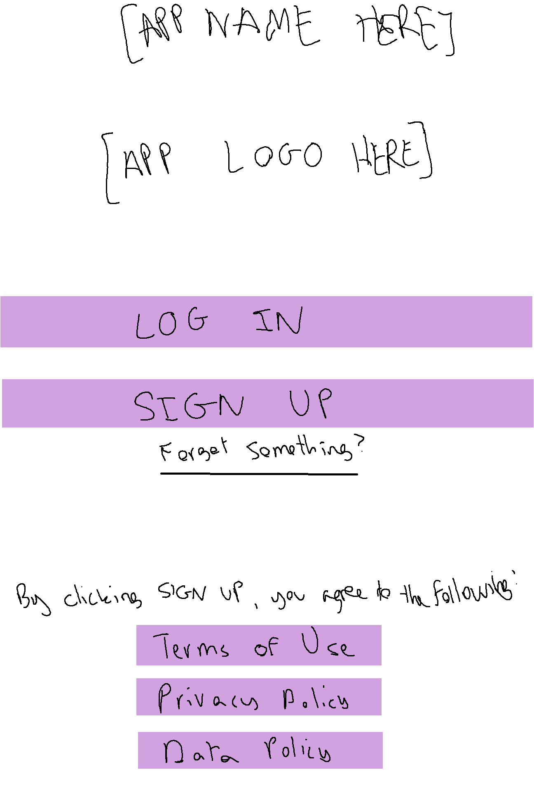
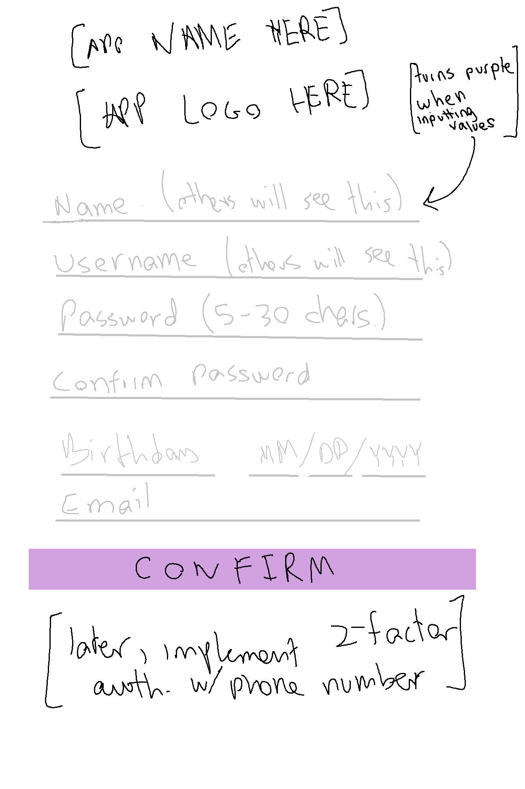
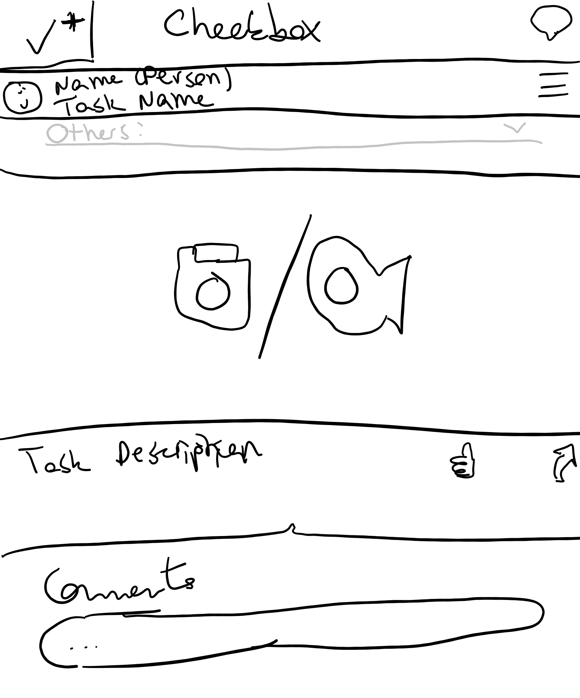
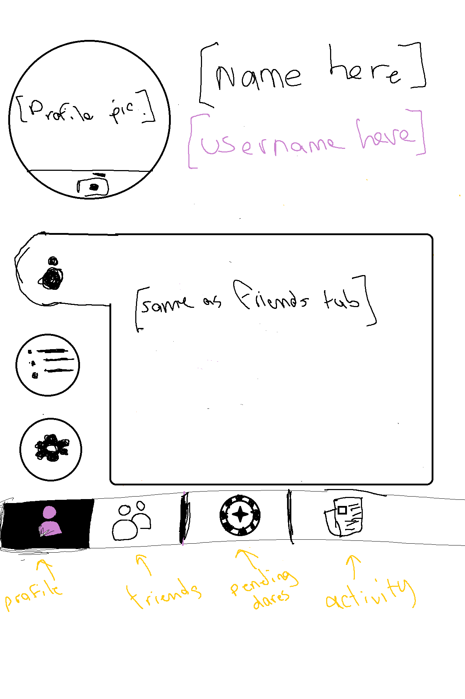
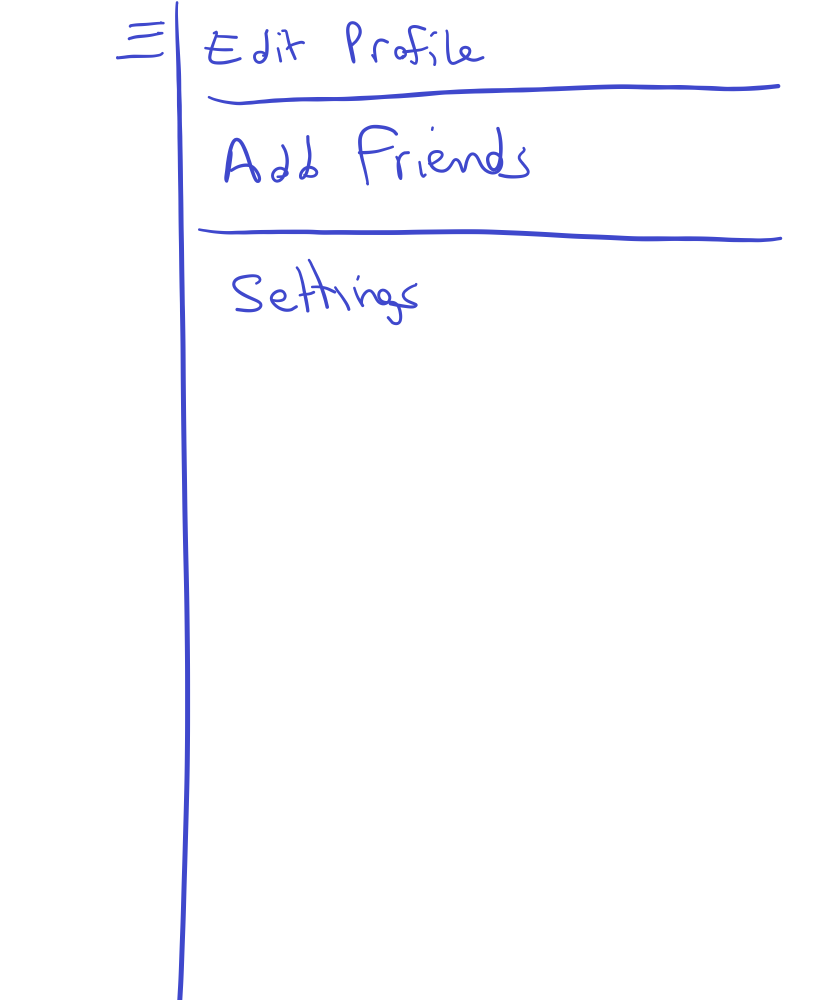
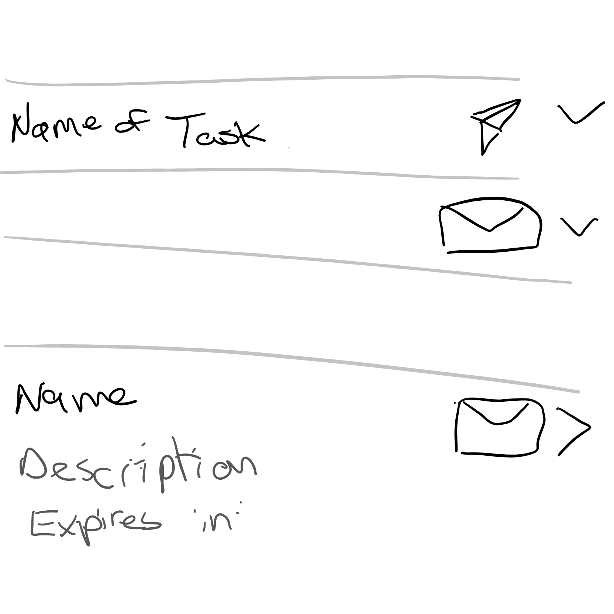
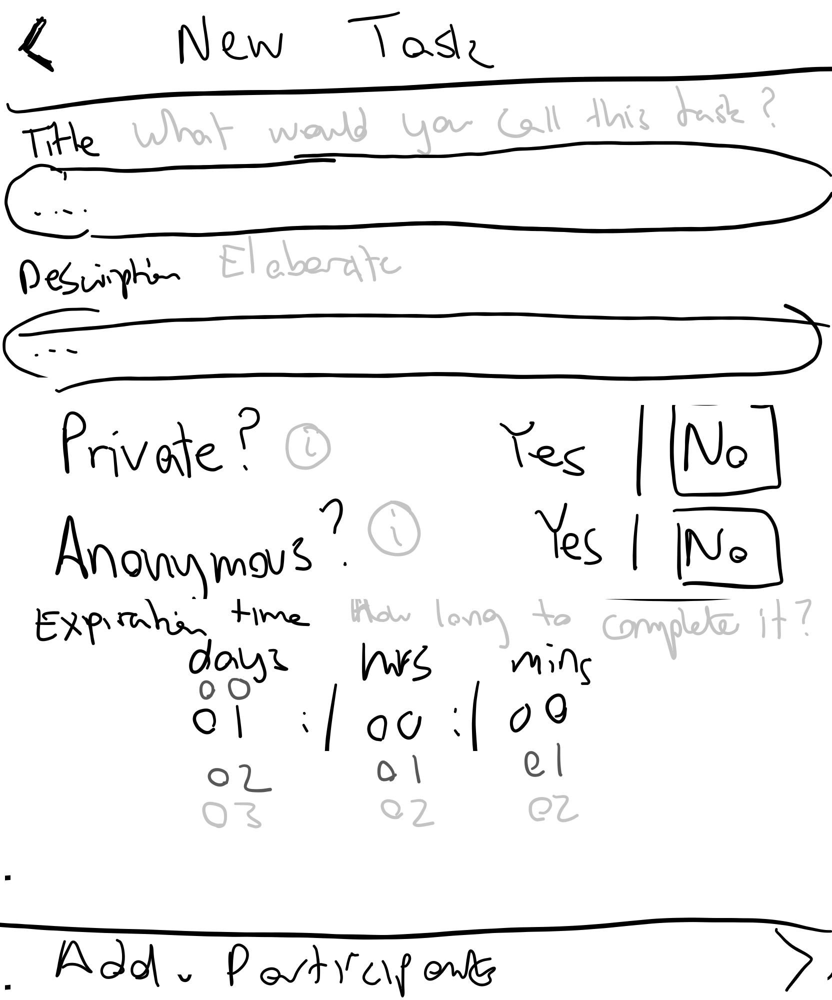
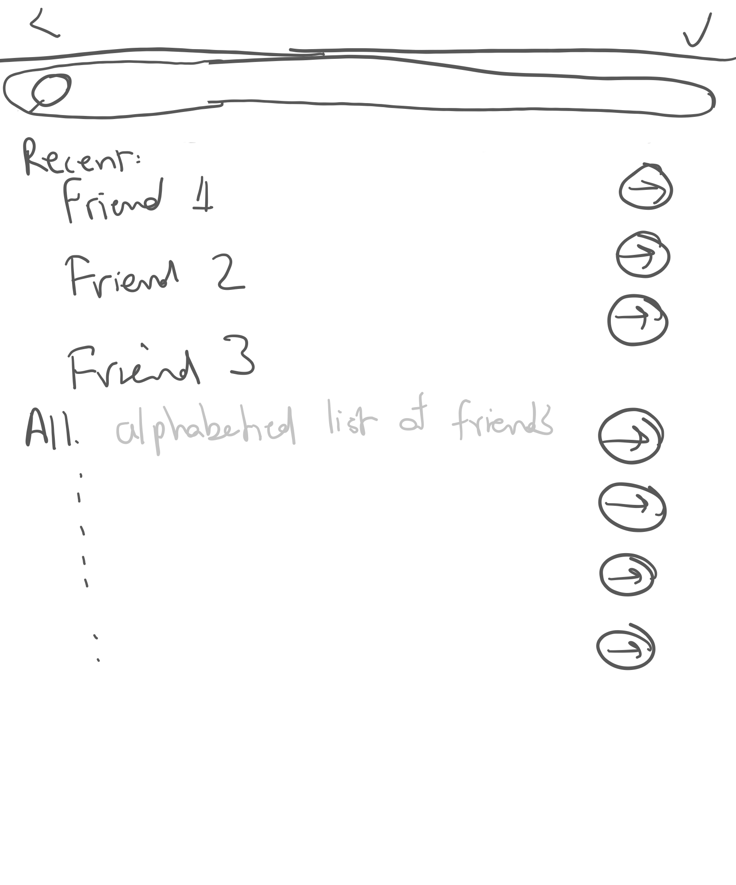
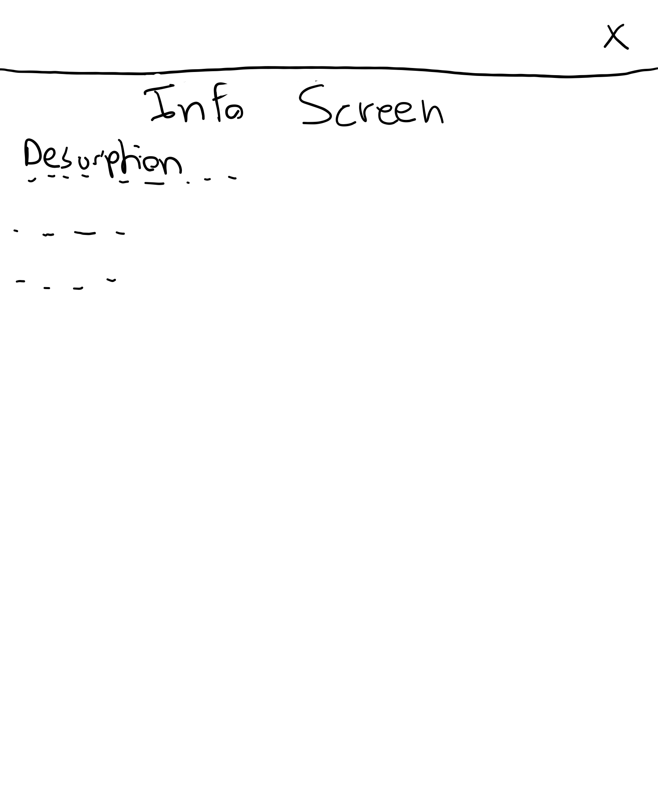
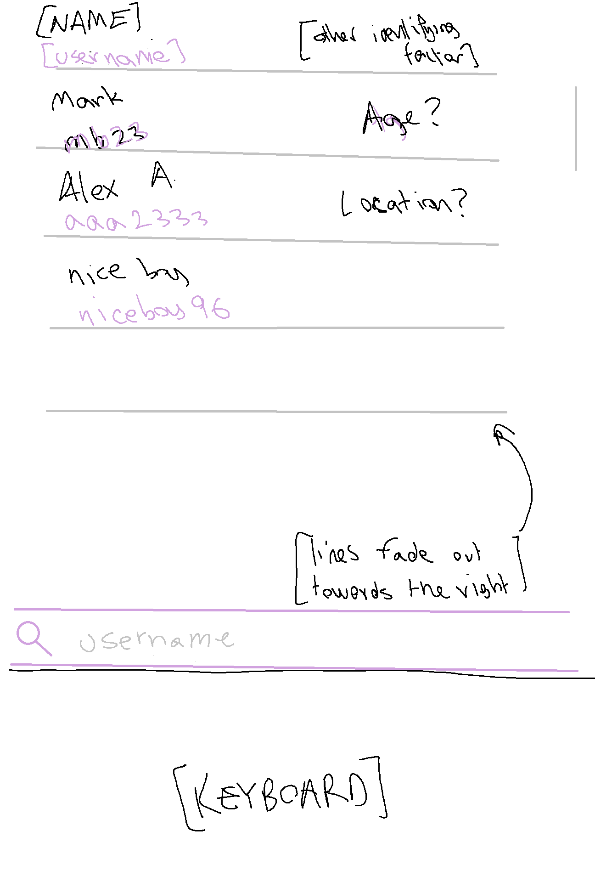

# **CheckBox** 

### Main functionality: send and receive tasks to and from friends.
CheckBox is built using React Native with a Firebase backend, defaulting to using the `npm` package manager. We are using the Expo client with `create-react-native-app` to run the app. To test, run `npm start` and scan the QR with the Expo client app. To test on native emulators, press `i` for iOS and `a` for Android (after you've run `emulator @Nexus_5X_API_Q`).

##Solving Common Errors:

* EACCES Permission denied: `sudo chown -R $USER ~/.npm`

##Permissions:

* Camera
* Coarse Location
* File Access

--

--

--

--

--

--

--

--

--

##Layout:

* See Instagram's layout for reference. It will have a navigation bar at the bottom with the following pages: News (with a search bar at the top), Tasks (includes search bar at the top), Search, Profile.

##Pages: 

* News: Like Facebook news. Each recent post includes a friend's name (this is the person who completed the task), below that their task description + **sent by**: *sender*, below that the proof of completion, either a photo or video. These posts can be liked/upvoted and commented on.
* Tasks: Split into two parts - incomplete outbound tasks and incomplete inbound tasks. Will also have a button to create a new task.
* Search: Search for peoples' profiles, where you can add them as a friend, see their statistics, see their friends and view their public completed tasks.
* Profile: Your profile picture (taken in the moment or selected from stored personal photos), completed tasks, friends, statistics, settings.

##Sign-up: 
First name, Last name, Username, Date of Birth, E-mail. Must agree to Terms and Conditions and Privacy Policy. 

##Features:

* <b>Anonymity</b>: Task senders can make his or herself anonymous until completion of the task, whether sent privately or publicly. Once the other party completes the task by sending proof of completion, the sender's identity will be uncovered.

* <b>Privacy</b>: Tasks, whether sent anonymously or not, can be either private or public. Public tasks will be automatically published for all friends of both (or all) participants to see in the News page. In addition, public tasks will appear on both/all parties' News page in an incomplete format. People who see the incomplete task in their News page can 'nudge' it. Private tasks are not automatically published - they are first sent to archived/completed tasks in the recipient's profile page. Private tasks are not displayed in News. Public tasks can be made private and private tasks can be made public as long as all participants (sender + receiver(s)) agree to it. If a task participant who is not the task creator wants to change said task from public to private, he or she must submit a privacy request, which is shown to the task creator.

* <b>Task Management</b>: Public completed tasks can be viewed by anyone, even if not present in News, by finding any of the participants' profiles and looking through their completed tasks. Public completed tasks, even if sent to multiple people by the creator, appear in individual posts mentioning just the creator and the specific participant. There is a menu bar option on the post that allows outside viewers to see all participants in that task. When a public task is deleted by the creator of the task, it will be deleted for the participant(s) as well. For a post that is deleted by a participant, not the creator, the individual post that cites the creator and that participant will be deleted for both the participant and the creator; however, if the task had many recipients, because the task creator did not delete it, all other posts related to that task will remain untouched.
 
* <b>Creating Tasks</b>: The sender must provide a description of the task (in a text box), must identify at least one recipient (from list of friends), must select either Public or Private, must select to send anonymously or not, and set an expiration time (choices are 1 hr, 12 hr, 1 day, 1 wk (for now)). 

* <b>Receiving Tasks</b>: Upon receiving a task, all information about the task will be available (except the identity of the sender if he or she sent it anonymously). The recipient has one day (24 hrs from time of delivery) to 'accept' or 'decline' the task, otherwise it gets deleted for that recipient. If the task was sent to multiple people, declining the task will not delete the task for other recipients before the response time expires. 

* <b>Friends</b>: Friends can be added by username, by name, or from contacts. Friend requests will appear in profile.

* <b>Incomplete Tasks</b>: Tasks yet to be completed by the recipient(s) will be displayed in the incomplete outbound tasks section with an expiry time. If sent to multiple friends, you can tap this task and see who has accepted/declined and who has completed it. 

* <b>Statistics</b>: # Public tasks completed, # Private tasks completed, Account creation date.

* <b>Searching</b>: You can search by real name or username.

##Data Collection: 
####We will collect data that we can then rent out to companies for profit. Keep track of anything useful.

* Age (from birthday)
* Number of tasks created a day (overall and per person on a daily, weekly, and monthly basis)
* Task categories and how common they are: games, music, food, culture, religious, etc. + tasks in each category (TBD with MLKit)
* Number of tasks with more than 2 participants
* Etc.

