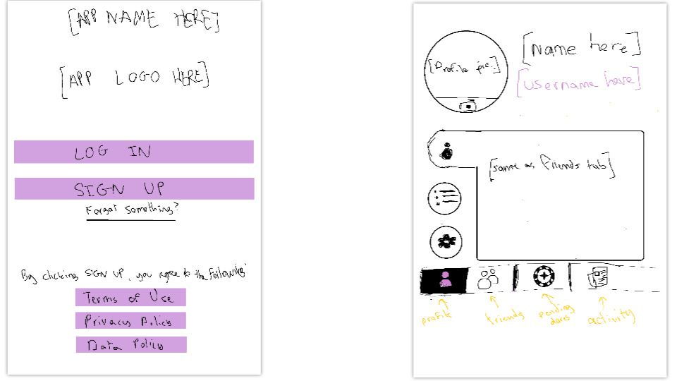
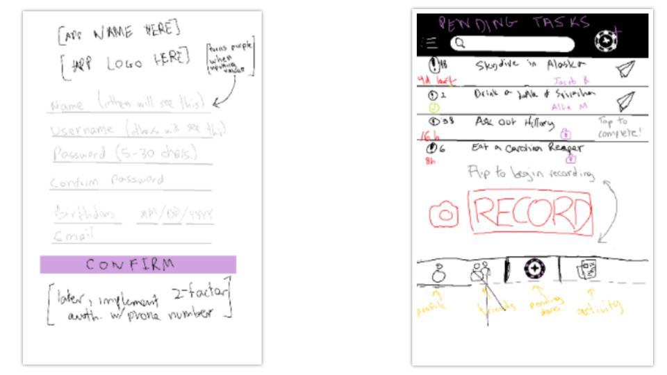
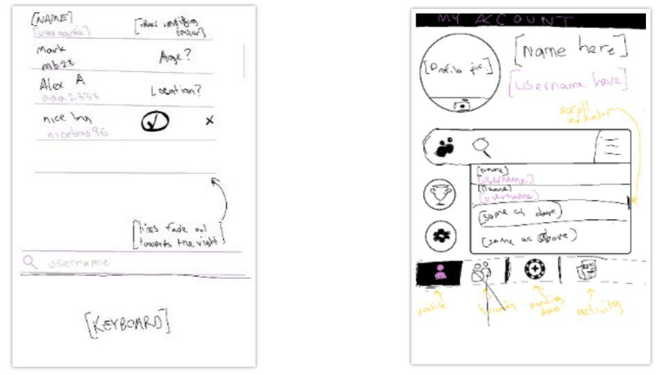

# **Checkbox** 

### Main functionality: send and receive tasks to and from friends.
CheckBox is built using React Native with a Firebase backend, defaulting to using the `yarn` package manager (as opposed to `npm`). To test Android: `emulator @Nexus_5X_API_Q` (to connect the emulator) then `yarn run android`. To test iOS: `yarn run ios`.

Ways to deal with errors:

* EACCES Permission denied: `sudo chown -R $USER ~/.npm`
* Command Shift K in Xcode

Permissions needed:

* Camera
* Coarse Location
* File Access

*Layout*:

* See Instagram's layout for reference. It will have a navigation bar at the bottom with the following pages: News (with a search bar at the top), Tasks (includes search bar at the top), Search, Profile.

*Pages*: 

* News: Like Facebook news. Each recent post includes a friend's name (this is the person who completed the task), below that their task description + **sent by**: *sender*, below that the proof of completion, either a photo or video. These posts can be liked/upvoted and commented on.
* Tasks: Split into two parts - incomplete outbound tasks and incomplete inbound tasks. Will also have a button to create a new task.
* Search: Search for peoples' profiles, where you can add them as a friend, see their statistics, see their friends and view their public completed tasks.
* Profile: Your profile picture (taken in the moment or selected from stored personal photos), completed tasks, friends, statistics, settings.

*Sign-up*: First name, Last name, Username, Date of Birth, E-mail, Phone Number. Must agree to Terms and Conditions. 

*Features*:

* Anonymity: Task senders can make his or herself anonymous until completion of the task, whether sent privately or publicly. Once the other party completes the task by sending proof of completion, the sender's identity will be uncovered.
* Privacy: Tasks, whether sent anonymously or not, can be either private or public. Public tasks will be automatically published for all friends of both (or all) participants to see in the News page. In addition, public tasks will appear on both/all parties' News page in an incomplete format. People who see the incomplete task in their News page can 'nudge' it. Private tasks are not automatically published - they are first sent to archived/completed tasks in the recipient's profile page. Private tasks are not displayed in News. Public tasks cannot be made private, but private tasks can be made public as long as all participants (sender + receiver(s)) agree to it.
* Task Management: Public completed tasks can be viewed by anyone, even if not present in News, by finding any of the participants' profiles and looking through their completed tasks. However, if one person deletes a task from their archived tasks, that same task will be automatically made private in all other participants' archived/completed task sections. Similarly, if the task *is* in News and one participant deletes it, it becomes private for all other participants. 
* Creating Tasks: The sender must provide a description of the task (in a text box), must identify at least one recipient (from list of friends), must select either Public or Private, must select to send anonymously or not, and set an expiration time (choices are 1 hr, 12 hr, 1 day, 1 wk (for now)). 
* Receiving Tasks: Upon receiving a task, all information about the task will be available (except the identity of the sender if he or she sent it anonymously). The recipient has one day (24 hrs from time of delivery) to 'accept' or 'decline' the task, otherwise it gets deleted for that recipient. If the task was sent to multiple people, declining the task will not delete the task for other recipients before the response time expires. 
* Friends: friends can be added by username, by name, or from contacts. Friend requests will appear in profile.
* Incomplete Tasks: Tasks yet to be completed by the recipient(s) will be displayed in the incomplete outbound tasks section with an expiry time. If sent to multiple friends, you can tap this task and see who has accepted/declined and who has completed it.
* Verifying task completion: When proof of completion is sent, the sender views said proof and decides whether to accept it or not. If accepted, proceed as described above. If declined, the task is forfeited and deleted. In the case where a task has multiple recipients, the task is only deleted for that recipient and the sender does not have access to their proof of completion. In the case where the sender was anonymous, if the sender declines the proof, they remain anonymous. If not, their identity is revealed to that recipient. 
* Statistics: # Public tasks completed, # Private tasks completed, Account creation date.
* Searching: You can search by real name or username, but real names are only shown for people in your friends list.

*Data Collection*: We will collect data that we can then rent out to companies for profit. Keep track of anything useful.

* Age (from birthday)
* Number of tasks created a day (overall and per person on a daily, weekly, and monthly basis)
* Task categories and how common they are: games, music, food, culture, religious, etc. + tasks in each category
* Number of tasks with more than 2 participants
* Etc.

